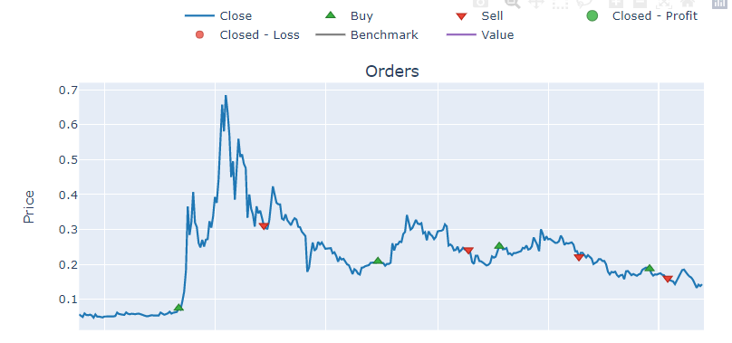
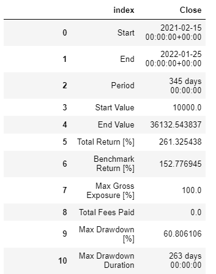
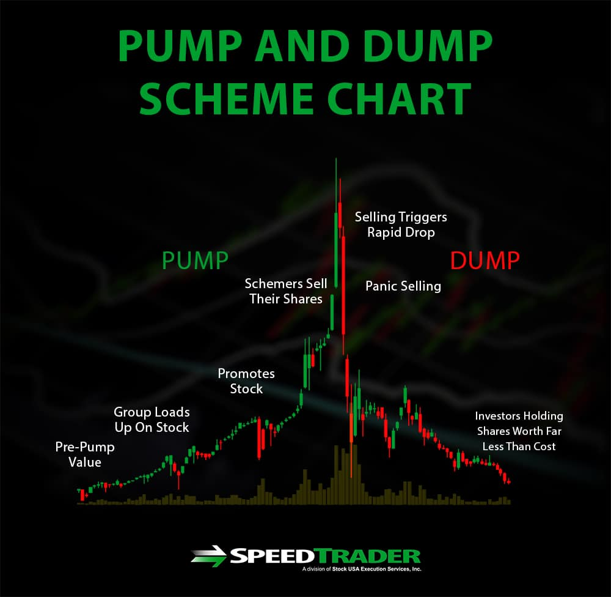
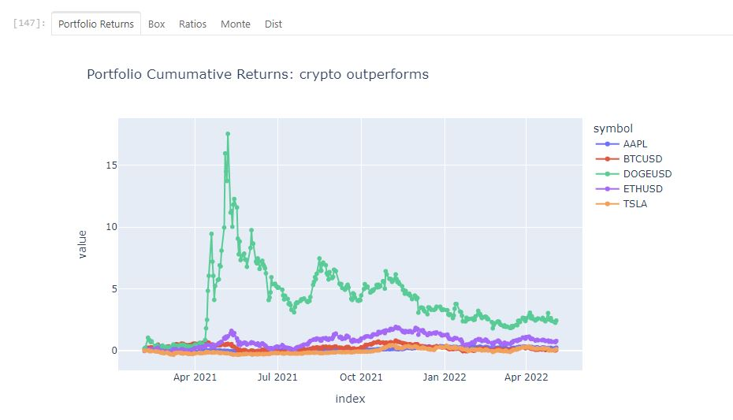

# First_project
# **Pump And Dump**

Crypto pump-and-dumps are when people (conspirators) use misleading information to raise the price of a cryptocurrency so they can sell it and profit from there [^1]

---
 >*"Our research noted that the timescale of modern pump-and-dump schemes has shortened, with many pumps lasting only seconds to minutes before the peak is reached."*[^2]
---

Hello, for this section I will be analysing the high like and retweet counts I found interesting from Amy’s cleaned data, as I wanted to see the relationship between the level of engagement and stocks and crypto.

After isolating  the entire dataframe into keywords that we decided to be relevant around our objective, this includedTSLA, & Doge being an obvious choice and using bitcoin was important as a benchmark or index. Looking at this correlation heap map we first noticed the range of our limited data, that being

15 tweets for bitcoin
Doge had 13
And tsla 107
You can see that from all the empty cells within this heat map.

---

---

---

Next we noticed that the highest correlation was only for doge with the least amount of tweets. Investigating this further we can
Zoom into this period and discover that this was not in a sequence by date. If I hover over this period and draw your attention to the likes by pct and the pct of the close price for DogeUSD per day.

the highest correlation in dark red is for the 1st of april 2021. The dark yellow being the beginning of this period. And the least correlated in light yellow was the extent on 25th of January 2022.

---

---

To get a realistic result, we wanted to backtest this time period by learning vectorbt a python library. With a relative strength index trading strategy. By not going to deep into trading as we are not professions in this field. We basically set entry and exit dates based on wether the market was over bought or over sold, or in laments term wether there was confidence in the market or not.

---

---

Hypothetically if we started trading with $10,000 usd dollars on the 15th of February 2021 and ended 345 days later on the 25th January 2022. We could’ve made a 261% increase. Taking $10,000 to $36,142 in less than one year.

What’s important to see here is that there is evidence of pump and dump dogecoin where a community will hype up the social value in turn the stock value will increase with a nice return. By no means are we implying Elon musk was responsible for this, but it is evident that his tweets have a direct relationship for increase in DOGEUSD price during this specific period.

Table 1.0 *Aspects of P&D*[^3]

---

# **First collaborative project** 

You are in TWitter Branch, only work on twitter files on this branch
#Images

#Dashboard graph shows a schmatics of dashboard, Some charts don't render (DK why as turos were not able to help me)

---

---

#Sharpe ratio used panel compared ris / returs on peer group, Dodge coin offers the best return vs risk

---

---

#Simulation to choose best return option for a portfoli

---

---

#Created a Bollenger bars to aid decissionmakng 

---

[^1]: *Cryptocurrency: What's a dump-and-pump scam and how to avoid it? https://www.marca.com/en/lifestyle/us-news/2022/02/19/621121b5268e3ec64d8b45da.html

[^2]: *Cryptocurrency pump-and-dumps, https://blogs.biomedcentral.com/on-society/2019/01/22/cryptocurrency-pump-and-dumps/

[^3]: *Pump and dump scheme chart, https://speedtrader.com/pump-and-dump-schemes/

